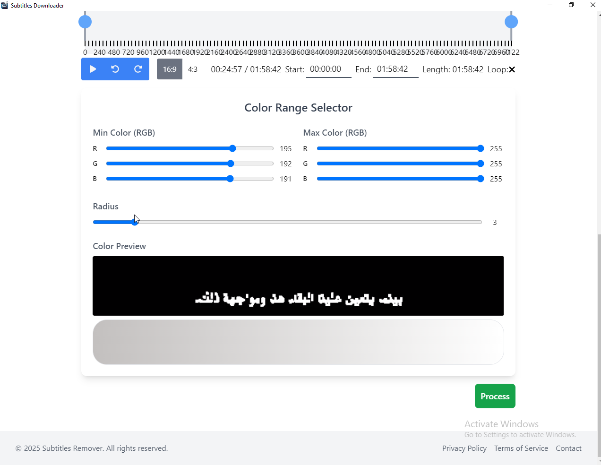
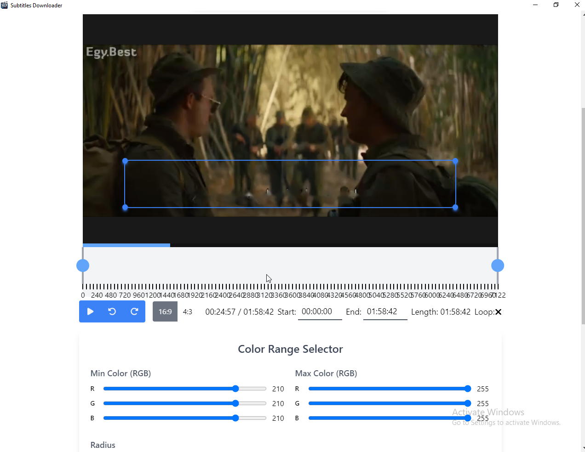

# Hardcoded Subtitles Remover
## Overview

This is a Windows application designed to remove hardcoded subtitles from videos. The program allows users to select the area where subtitles appear and specify a color range to be removed. It then generates a mask and inpaints the frames, allowing users to see the results simultaneously.

## Purpose

This program is particularly useful for students and language learners who already understand some of a movie's language but find subtitles distracting. By removing the subtitles, learners can focus more on the spoken dialogue, making it easier to improve their listening and comprehension skills. This tool allows them to have another version of the movie without subtitles.

## Technologies Used

- **Frontend & Backend:** Node.js, Next.js, Electron, TailwindCSS
- **Subtitle Removal:** Implemented using Python and OpenCV

## Features

-   Cut specific portions of the video as needed.
    
-   Select the subtitle area manually.
    
-   Define the color range for subtitle removal.
    
-   Generate a mask and apply inpainting to reconstruct the frames.
    
-   Real-time preview of the processed frames.

## Known Issues

This application is still under development, and there are some issues that need to be resolved:

- **Performance Issues with Large Videos:** If the video is too large, the application may struggle to display it properly, though processing remains functional.
- **Startup Delay:** The application may take some time before it starts displaying the video, and in some cases, it might fail to show the video.
- **Seeking Issues:** There may be problems displaying the previous frame when seeking backward in the video.

## Contribution

This project is still a work in progress, and I welcome any contributions to help improve its functionality and performance. If you're interested in contributing, feel free to submit issues, feature requests, or pull requests.
